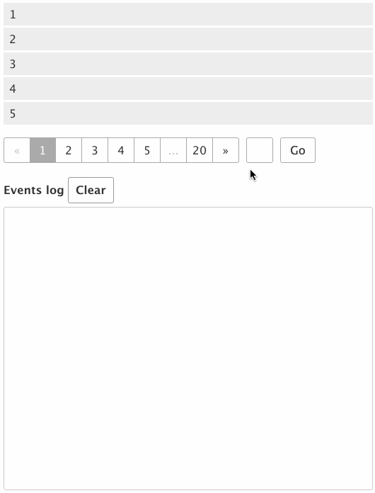

# Pagination.js

> A jQuery plugin to provide simple yet fully customisable pagination.

[![NPM version][npm-image]][npm-url]
[![Bower version][bower-image]][bower-url]
[](https://cdnjs.com/libraries/paginationjs)

[npm-url]: https://npmjs.org/package/paginationjs
[npm-image]: http://img.shields.io/npm/v/paginationjs.svg
[bower-url]:http://badge.fury.io/bo/paginationjs
[bower-image]: https://badge.fury.io/bo/paginationjs.svg



See demos and full documentation at official site: [http://pagination.js.org](http://pagination.js.org)

# Installation / Download

`npm install paginationjs` or `bower install paginationjs` or just download [pagination.js](dist/pagination.js) from the git repo.

# Quick Start

```html
<div id="data-container"></div>
<div id="pagination-container"></div>
```

```js
$('#pagination-container').pagination({
    dataSource: [1, 2, 3, 4, 5, 6, 7, ... , 195],
    callback: function(data, pagination) {
        // template method of yourself
        var html = template(data);
        $('#data-container').html(html);
    }
})
```

# Rendering data

Below is a minimal rendering method:

```js
function simpleTemplating(data) {
    var html = '<ul>';
    $.each(data, function(index, item){
        html += '<li>'+ item +'</li>';
    });
    html += '</ul>';
    return html;
}
```

Call:

```js
$('#pagination-container').pagination({
    dataSource: [1, 2, 3, 4, 5, 6, 7, ... , 195],
    callback: function(data, pagination) {
        var html = simpleTemplating(data);
        $('#data-container').html(html);
    }
})
```

To make it easier to maintain, you'd better use specialized templating engine to do that. Such as [Handlebars](http://handlebarsjs.com/) and [Undercore.template](http://underscorejs.org/#template).

### Handlebars

```html
<script type="text/template" id="template-demo">
    <ul>
    {{#each data}}
        <li>{{this}}</li>
    {{/each}}
    </ul>
</script>
```

```js
$('#pagination-container').pagination({
    dataSource: [1, 2, 3, 4, 5, 6, 7, ... , 195],
    callback: function(data, pagination) {
        var html = Handlebars.compile($('#template-demo').html(), {
            data: data
        });
        $('#data-container').html(html);
    }
})
```

### Underscore

```html
<script type="text/template" id="template-demo">
    <ul>
    <% for (var i = 0, len = data.length; i < len; i++) { %>
        <li><%= data[i] %></li>
    <% } %>
    </ul>
</script>
```

```js
$('#pagination-container').pagination({
    dataSource: [1, 2, 3, 4, 5, 6, 7, ... , 195],
    callback: function(data, pagination) {
        var html = _.template($('#template-demo').html(), {
            data: data
        });
        $('#data-container').html(html);
    }
})
```

Or any other templating engine you prefer.

# License

Released under the MIT license.

MIT: [http://rem.mit-license.org](http://rem.mit-license.org/), See [LICENSE](/LICENSE)
